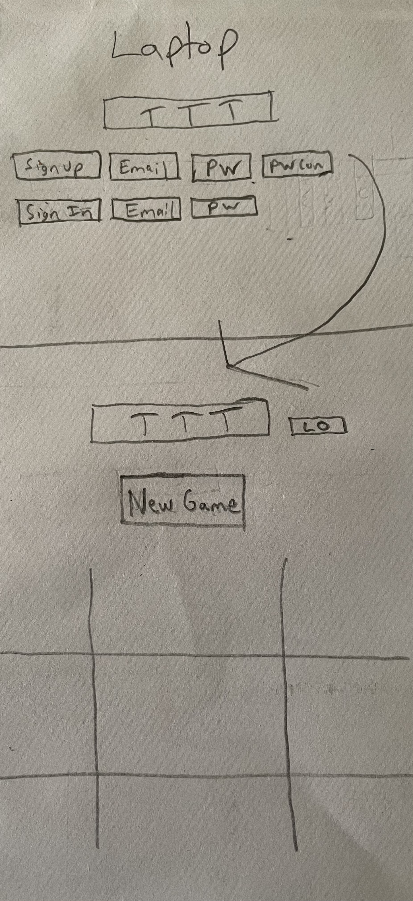

# Application Title: Tic-Tac-Toe #

This application allows the user to 1) sign up and 2) sign in to 3) play tic-tac-toe, alternating between Player 1 (X) and Player 2 (O).

## Important Links ##

[Deployed Client] (https://github.com/gargygargz/TicTacToe-client)

## Planning ##

### User Stories ###

- As a user, I want to sign up so I can sign in
- As a user, I want to to sign in so I can play
- As a user, I want to start a game
- As a user, I want to play X's followed by O's
- As a user, I want to reset the board and play again
- As a user, I want to sign out

### Wireframe ###

